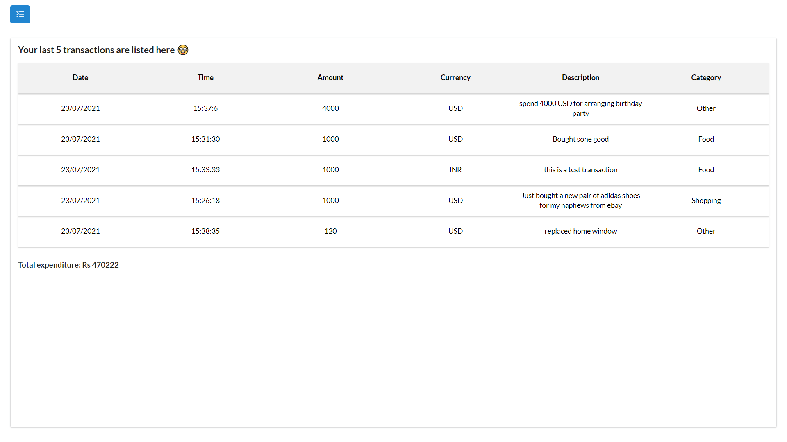

# expense-manager-nymble

## Expense Manager: 
## Requirements:

- [x] User authentication: SignIn and Signup
- [x] Provide three pages - Dashboard, Expenses, and reports accessible through a navbar.
- [x] Dashboard:
    1. Show total spent amount
    2. List last 5 transactions
- [x] Expenses:
    1. List of expenses for the current user.
    2. Button to create a new expense.
    3. Must contain the following fields: DateTime, Amount, Currency, Description (optional), and a Category.
    4. The categories are -- Home, Food, Fuel, Shopping and Other.
    5. Can be created only after logging in
    6. Can be read only by the user who owns it.
    7. Can be updated or deleted by the user who owns it.
    8. Ability to filter the expenses by category.
- [x] Report:
    1. Show total amount spent per week of the current month.
    2. Show total amount spent per category basis on the current month.
- [x] The front-end must be a Single-Page-Application.
- [x] Follow proper design guidelines and coding standards.

## Improvements

These are optional improvements that’ll help in boosting your submission score.

- [x] No business logic code in client app. (It must be only on the backend-server)
- [x] The front-end web client is a PWA (Progressive Web App).
- [x] Hosting the front-end and back-end to a cloud or hosting provider.
    1. Better if the cloud provider is Google Cloud Platform.
- [ ] Using GraphQL instead of traditional REST API.
- [ ] Pagination on the list of expenses.
- [ ] Use ReactiveExtensions in client web app: (RxJs for Javascript)
- [x] User roles -- Admin and normal users.
    1. A separate page for Admin listing all users (only accessible by admin users)
    2. Admin users can view the expenses of all the users.
    3. Admin users can edit or delete the expense of all users.
    
##### Legend 
- [x] : requirement fulfilled
- [ ] : not implemented

## Sneak Peak: 
- App Landing page

- user login page

- user register page

- Once user logged in he is redirected to dashboard which has a log of his last 5 transations 

- Here use can add/edit/delete expenses also user can filter out the expenses. And to navigate to different pages he can use the burgermenu in left.

- This page displays weekly expenditure report of current month PS: user can choose currency in which he needs report.

- Login page for admin

- Once admin logged in he can see the list of all user over his dashboard

- Admin can edit/delete the expense of any user through this page

## Routing structure:

### Routes accessible by normal users:

- `[POST] /login`: utilized for authenticating user.
- `[POST] /register`: utilized for registering user.
- `[POST] /dashboard/add-expense`: utilized for adding transation by user.
- `[GET] /dashboard/all-expenses`: utilized for accessing all transations added by user.
- `[DELETE] /dashboard/delete/:id`: utilized to delete a particular transaction from database.
- `[PUT] /dashboard/update/:id`: utilized for updating any transaction.
- `[GET] /dashboard/reports`: utilized for accessing particular user report.

### Routes accessible only by admin:

- `[POST] /admin/login`: utilized for authenticating admin user.
- `[GET] /admin/all-users`: utilized for accessing all users via admin user.
- `[GET] /admin/all-expenses/:id`: utilized by admin user to access all transaction of a any user.
- `[POST] /admin/delete/:id`: utilized by admin user to delete any transaction of any user.
- `[PUT] /admin/update/:id`: utilized by admin user to update any transaction of any user.

## Authentication:

- Token(JWT) based authentication strategy has been used to authorize user, admin user and each request made by any user. 

## Hosting:
- FE here: https://expense-manager-nymble.netlify.app/
- BE here: https://aqueous-ridge-34051.herokuapp.com/

## Test accounts (you can create new if you want):
- email: user1@gmail.com
- password: 123456

- email: user2@gmail.com
- password: 123456

PS: please wait after 1-2 second after adding expense as it takes little time to update 😅
